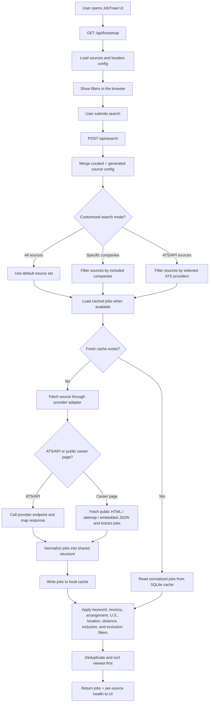

# JobTrawl

JobTrawl is a local-first job search app that aggregates direct job listings from employer career pages and ATS job boards into one searchable interface. Instead of relying on job aggregators like LinkedIn or Indeed, it pulls openings from company-controlled sources, normalizes the results into a shared format, caches them locally, and lets you filter the combined list in one place.

It is designed for two kinds of coverage:

- Curated sources you hand-pick in `config/sources.json`
- Large generated ATS inventories imported into `config/openpostings-sources.json`

The result is a local search console that can cover both carefully chosen employers and much broader ATS ecosystems.

## What JobTrawl does

- Searches many employer job sources in one request
- Uses direct ATS APIs when they are available
- Falls back to parsing public employer career pages when there is no clean public API
- Normalizes results from different systems into one shared job shape
- Caches fetched jobs locally in SQLite for faster repeat searches
- Deduplicates and sorts matches across sources
- Returns partial results if some sources fail or time out
- Lets you narrow results by title, date, work arrangement, location, excluded companies, and customized source selection by specific companies or ATS/API provider type

## How it works

At a high level, JobTrawl does four things:

1. Loads source definitions from `config/sources.json` and `config/openpostings-sources.json`
2. Fetches jobs from each source using an adapter for that ATS or career-page pattern
3. Stores normalized jobs in a local cache database under `data/jobs-cache.sqlite`
4. Applies search filters and returns one unified results list to the UI

### Search flow



## Filters

The UI in `public/index.html` and `public/app.js` supports these filters:

- `Keyword or title`
- `Strict keyword search` or `Loose keyword search`
- `Posted within`: `24h`, `3d`, `7d`, `14d`, `30d`
- `Work arrangement`: `remote`, `hybrid`, `onsite`
- `Location mode`
- `No location filter`
- `Use manual location`
- `Use my location`
- `U.S. jobs only`
- Manual state + city/area groups from `config/locations.json`
- Distance from your detected browser location
- Excluded companies
- Customize search by `Specific companies` or by `ATS/API sources`

### How the filters behave

- Keyword matching can run in strict or loose mode.
- Loose matching expands many common role aliases. For example, a query like `product manager` can also match nearby role variants defined in `src/lib/filters.js`.
- Recency uses `postedAt` when available.
- Arrangement filtering normalizes values to `remote`, `hybrid`, `onsite`, or `unknown`.
- Location filtering is text-based unless the distance filter is active.
- The distance filter uses browser coordinates plus a built-in location alias map for supported metros.
- `U.S. jobs only` keeps postings that clearly look U.S.-based and can optionally keep unknown-location jobs in a separate section.
- Customized search can either filter to an included company list or limit the search to selected ATS/API provider families.
- Excluded companies are filtered out after normalization.
- Results are deduplicated by source, company, title, location, and arrangement.

## Source strategies

JobTrawl uses adapters in `src/lib/adapters/` to fetch jobs. Those adapters generally fall into two buckets.

### 1. Direct ATS / public API integrations

When an ATS exposes a stable endpoint, JobTrawl calls that endpoint directly and converts the response into a common internal shape.

Examples in this repo include:

- `Greenhouse` via `https://boards-api.greenhouse.io/...`
- `Lever` via `https://api.lever.co/...`
- `Workday` via `.../wday/cxs/.../jobs`
- `Ashby`
- `SmartRecruiters`
- `Workable`
- `Recruitee`
- `Breezy`
- `Teamtailor`
- `Zoho`
- many other ATS-specific adapters now included under `src/lib/adapters/`

What this approach is doing:

- Sending HTTP requests to a provider-specific job endpoint
- Paging through results when needed
- Pulling fields like title, location, department, posted date, apply URL, and job description
- Converting each provider response into a shared normalized job object

This is the cleanest and most reliable path because the source data is already structured.

### 2. Public career-page parsing and scraping

Some employers expose jobs only through public website pages instead of a reusable anonymous API. In those cases, JobTrawl fetches the public career page and extracts jobs from the markup or embedded page data.

This logic lives mostly in `src/lib/adapters/hosted-board.js`.

What this approach is doing:

- Downloading public HTML from a careers page
- Checking for structured job data such as:
- JSON-LD job postings
- embedded preload state
- ATS-specific inline JSON blobs
- Phenom or similar embedded datasets
- job sitemaps
- provider-specific HTML list layouts
- Falling back to link extraction when a page looks like a job list but does not expose a cleaner data structure
- Filtering out non-job links like login pages, blog pages, talent networks, privacy pages, and generic careers landing pages
- Optionally opening some job detail pages to enrich missing posted dates

This is effectively "scraping" public employer career pages, but it is focused on publicly visible job content and tries structured data first before falling back to looser HTML parsing.

### Why both approaches matter

There is no single public API for every ATS and every employer website. JobTrawl mixes API adapters with public-page extraction so it can cover both:

- ATS platforms with usable public endpoints
- employer-hosted career sites that only expose jobs through HTML, embedded JSON, or sitemaps

That hybrid approach is the main reason the project can support a wide range of sources.

## Normalization and filtering pipeline

Regardless of where a job comes from, adapters try to normalize it into a common structure with fields such as:

- source key
- company
- provider
- title
- department or team
- location label
- city / region / country
- work arrangement
- posted / updated timestamps
- apply URL
- description snippet
- search text
- employment type
- compensation

After normalization, `src/lib/search.js` applies the search filters, counts matches per source, sorts jobs by date, and deduplicates the final list.

## Local cache

JobTrawl caches jobs on disk so searches do not always need to refetch every source.

- Primary cache: `data/jobs-cache.sqlite`
- Fallback cache: `data/jobs-cache.json` if SQLite is unavailable

Cache behavior:

- Each source has sync state and last error tracking
- Stale sources can be refreshed
- Searches can reuse fresh cached results
- Generated inventory sources are included by default only after they have been synced locally
- Expired postings are pruned automatically

There are also API endpoints for cache status and manual sync:

- `GET /api/cache/status`
- `POST /api/cache/sync`

## Source configuration

JobTrawl merges two source files:

- `config/sources.json`: curated, hand-maintained sources
- `config/openpostings-sources.json`: generated ATS inventory

On the current branch, the repo contains:

- about `120` curated sources
- about `10,186` generated ATS sources

Generated inventory is created from the imported OpenPostings reference database using:

- `npm run import:openpostings`

and can be synced into the local cache in batches with:

- `npm run sync:generated-ats`

## Supported provider families

The adapter registry currently includes support for:

- `Greenhouse`
- `Lever`
- `Workday`
- `Ashby`
- `SmartRecruiters`
- `Workable`
- `Recruitee`
- `Jobvite`
- `ApplicantPro`
- `ApplyToJob / JazzHR`
- `iCIMS`
- `UltiPro / UKG`
- `Taleo`
- `BambooHR`
- `BreezyHR`
- `ApplicantAI`
- `Career Plug`
- `Career Puck`
- `Fountain`
- `Gem`
- `Getro`
- `HRM Direct`
- `Jobaps`
- `JOIN`
- `Manatal`
- `SAP HR Cloud`
- `Talent Lyft`
- `Talent Reef`
- `Talexio`
- `Team Tailor`
- `The Applicant Manager`
- `Zoho Recruit`
- generic `Career Page` extraction for public employer sites

Coverage quality varies by provider and by company implementation. API-backed adapters are usually the most stable. Career-page extraction is broader but more fragile because employers can change their HTML at any time.

## Installation

### Requirements

- `Node.js 20+`
- `npm`
- Internet access for fetching job listings from public endpoints and career pages

### Download

```powershell
git clone https://github.com/<your-account>/JobTrawl.git
cd JobTrawl
```

### Install

```powershell
npm install
```

### Run

```powershell
npm start
```

If PowerShell blocks `npm`, use:

```powershell
npm.cmd install
npm.cmd start
```

Then open [http://localhost:3000](http://localhost:3000).

### Development mode

```powershell
npm run dev
```

## Basic usage

1. Start the app with `npm start`
2. Open `http://localhost:3000`
3. Enter a keyword or role title
4. Choose recency, arrangement, and location filters
5. Optionally customize the search to specific companies or ATS/API source types
6. Optionally exclude companies
7. Run the search
8. Open the direct application link from a result card

## Configuring your own sources

Add or edit entries in `config/sources.json`.

Example:

```json
{
  "key": "openai-ashby",
  "company": "OpenAI",
  "provider": "ashby",
  "organization": "openai"
}
```

```json
{
  "key": "stripe-greenhouse",
  "company": "Stripe",
  "provider": "greenhouse",
  "boardToken": "stripe"
}
```

```json
{
  "key": "example-careerpage",
  "company": "Example Co",
  "provider": "careerpage",
  "careersUrl": "https://example.com/careers"
}
```

Provider-specific fields vary by adapter. A few common examples:

- `greenhouse`: `boardToken`
- `lever`: `site`
- `ashby`: `organization`
- `workday`: `host`, `tenant`, `site`
- `smartrecruiters`: `companyIdentifier`
- `workable`: `subdomain`
- `recruitee`: `subdomain`
- `jobvite`: `site` or `careersUrl`
- `careerpage`: `careersUrl` plus optional parsing hints
- `icims`: source-specific credentials or portal details when required

## Project structure

```text
config/                     Source and location configuration
data/                       Local cache database and logs
public/                     Browser UI
scripts/                    Source import and sync helpers
src/server.js               HTTP server and API routes
src/lib/search.js           Search pipeline
src/lib/filters.js          Keyword, recency, arrangement, and location filters
src/lib/cache-db.js         Local cache layer
src/lib/adapters/           ATS and career-page adapters
```

## Notes and tradeoffs

- There is no universal public jobs API for every company or ATS.
- Some boards expose rich structured APIs; others require HTML parsing.
- Career-page scraping is inherently more brittle than API integrations.
- Posted dates are not always available; JobTrawl can keep unknown-date jobs in separate sections.
- Work arrangement and location metadata are inconsistent across employers, so normalization is best-effort.
- Source failures do not block the whole search; the app returns partial results when possible.

## Summary

JobTrawl is essentially a local job-ingestion and filtering engine for direct employer listings. It mixes provider APIs with public career-page scraping, converts everything into one normalized format, caches the results locally, and gives you a single UI to search across both curated and large generated ATS inventories.
