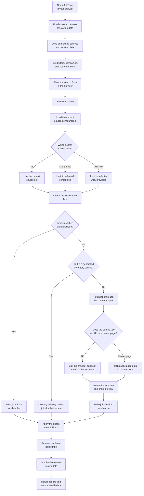

# JobTrawl

JobTrawl is a local-first job search app that aggregates direct job listings from employer career pages and ATS job boards into one searchable interface. Instead of relying on job aggregators like LinkedIn or Indeed, it pulls openings from company-controlled sources, normalizes the results into a shared format, caches them locally, and lets you filter the combined list in one place.

It is designed for two kinds of coverage:

- Curated sources you hand-pick in `config/sources.json`
- Large generated ATS inventories imported into `config/generated-ats-sources.json`

The result is a local search console that can cover both carefully chosen employers and much broader ATS ecosystems.

## What JobTrawl does

- Searches many employer job sources in one request
- Uses direct ATS APIs when they are available
- Falls back to parsing public employer career pages when there is no clean public API
- Normalizes results from different systems into one shared job shape
- Caches fetched jobs locally in SQLite for faster repeat searches
- Deduplicates and sorts matches across sources
- Returns partial results if some sources fail or time out
- Lets you narrow results by title, date, work arrangement, location, excluded companies, and customized source selection by specific companies or ATS/API provider type

## How it works

At a high level, a search in JobTrawl works like this:

1. JobTrawl loads its configured job sources and location lists.
2. When you run a search, it chooses which sources to search based on your settings:
   all default sources, specific companies, or selected ATS/API provider families.
3. It checks the local cache first so it does not have to refetch every source every time.
4. If fresh cached results are not available, it fetches jobs through the right adapter for that source.
5. It converts all jobs into one shared format, applies your filters, removes duplicates, sorts the results, and shows them in one list.

For most users, the important idea is simple: JobTrawl pulls direct listings from many company-controlled sources, standardizes them, and gives you one place to search them.

### Search flow


```mermaid
flowchart TD
    A["Open JobTrawl<br/>in your browser"] --> B["Run bootstrap request<br/>for startup data"]
    B --> C["Load configured sources<br/>and location lists"]
    C --> D["Build filters, companies,<br/>and source options"]
    D --> E["Show the search form<br/>in the browser"]

    E --> F["Submit a search"]
    F --> G["Load the current<br/>source configuration"]
    G --> H{"Which search<br/>mode is active?"}
    H -->|All| I["Use the default<br/>source set"]
    H -->|Companies| J["Limit to selected<br/>companies"]
    H -->|ATS/API| K["Limit to selected<br/>ATS providers"]
    I --> L["Check the local cache<br/>first"]
    J --> L
    K --> L
    L --> M{"Is fresh cached<br/>data available?"}

    M -->|Yes| N["Read jobs from<br/>local cache"]
    M -->|No| O{"Is this a generated<br/>inventory source?"}
    O -->|Yes| P["Use any existing cached<br/>jobs for that source"]
    O -->|No| Q["Fetch jobs through<br/>the source adapter"]

    Q --> R{"Does the source use<br/>an API or a career page?"}
    R -->|API| S["Call the provider endpoint<br/>and map the response"]
    R -->|Career page| T["Fetch public page data<br/>and extract jobs"]

    S --> U["Normalize jobs into<br/>one shared format"]
    T --> U
    U --> V["Write jobs back to<br/>local cache"]
    N --> W["Apply the user's<br/>search filters"]
    P --> W
    V --> W
    W --> X["Remove duplicate<br/>job listings"]
    X --> Y["Sort by the newest<br/>known date"]
    Y --> Z["Return results and<br/>source health data"]
```

The chart is intentionally simplified so it stays readable in GitHub's Mermaid viewer. The sections below explain the same flow in more detail.

## Filters

The UI in `public/index.html` and `public/app.js` supports these filters:

- `Keyword or title`
- `Strict keyword search` or `Loose keyword search`
- `Posted within`: `24h`, `3d`, `7d`, `14d`, `30d`
- `Work arrangement`: `remote`, `hybrid`, `onsite`
- `Location mode`
- `No location filter`
- `Use manual location`
- `Use my location`
- `U.S. jobs only`
- Manual state + city/area groups from `config/locations.json`
- Distance from your detected browser location
- Excluded companies
- Customize search by `Specific companies` or by `ATS/API sources`

### How the filters behave

- Keyword matching can run in strict or loose mode.
- Loose matching expands many common role aliases. For example, a query like `product manager` can also match nearby role variants defined in `src/lib/filters.js`.
- Recency uses `postedAt` when available.
- Arrangement filtering normalizes values to `remote`, `hybrid`, `onsite`, or `unknown`.
- Location filtering is text-based unless the distance filter is active.
- The distance filter uses browser coordinates plus a built-in location alias map for supported metros.
- `U.S. jobs only` keeps postings that clearly look U.S.-based and can optionally keep unknown-location jobs in a separate section.
- Customized search can either filter to an included company list or limit the search to selected ATS/API provider families.
- Excluded companies are filtered out after normalization.
- Results are deduplicated by source, company, title, location, and arrangement.

## Source strategies

JobTrawl uses adapters in `src/lib/adapters/` to fetch jobs. In practice, it gets job data in two main ways.

### 1. Direct ATS / public API integrations

When an ATS exposes a stable endpoint, JobTrawl requests job data directly from that endpoint and converts the response into a common internal shape.

Examples in this repo include:

- `Greenhouse` via `https://boards-api.greenhouse.io/...`
- `Lever` via `https://api.lever.co/...`
- `Workday` via `.../wday/cxs/.../jobs`
- `Ashby`
- `SmartRecruiters`
- `Workable`
- `Recruitee`
- `Breezy`
- `Teamtailor`
- `Zoho`
- many other ATS-specific adapters now included under `src/lib/adapters/`

This approach:

- sends requests to a provider-specific jobs endpoint
- pages through results when needed
- pulls fields like title, location, department, posted date, apply URL, and job description
- converts each response into the same shared job format used throughout the app

This is the cleanest and most reliable path because the source data is already structured.

### 2. Public career-page parsing and scraping

Some employers do not expose a clean public API. In those cases, JobTrawl fetches the public career page and extracts jobs from the page itself.

This logic lives mostly in `src/lib/adapters/hosted-board.js`.

This approach can include:

- downloading public HTML from a careers page
- looking for structured job data such as JSON-LD, embedded page state, ATS-specific JSON blobs, job sitemaps, or known provider layouts
- falling back to link extraction when a page clearly contains job listings but does not expose a cleaner data source
- filtering out non-job links such as login pages, blog pages, talent networks, privacy pages, and generic careers landing pages
- optionally opening some job detail pages to fill in missing posted dates

This is effectively "scraping" public employer career pages, but it is focused on publicly visible job content and tries structured data first before falling back to looser HTML parsing.

### Why both approaches matter

There is no single public API for every ATS and every employer website. JobTrawl mixes API adapters with public-page extraction so it can cover both:

- ATS platforms with usable public endpoints
- employer-hosted career sites that only expose jobs through HTML, embedded JSON, or sitemaps

That hybrid approach is the main reason the project can support a wide range of sources.

## What happens after jobs are found

Regardless of where a job comes from, JobTrawl converts it into a shared structure with fields such as:

- source key
- company
- provider
- title
- department or team
- location label
- city / region / country
- work arrangement
- posted / updated timestamps
- apply URL
- description snippet
- search text
- employment type
- compensation

After that, JobTrawl:

- applies your filters
- counts matches per source
- removes duplicates
- sorts results by the newest known date first
- shows source health information alongside the results

## Local cache

JobTrawl caches jobs on disk so searches do not always need to refetch every source.

- Primary cache: `data/jobs-cache.sqlite`
- Fallback cache: `data/jobs-cache.json` if SQLite is unavailable

Cache behavior:

- each source keeps sync state and last-error tracking
- searches can reuse fresh cached results
- stale sources can be refreshed
- generated inventory sources are included by default only after they have been synced locally
- expired postings are pruned automatically

There are also API endpoints for cache status and manual sync:

- `GET /api/cache/status`
- `POST /api/cache/sync`

## Source configuration

JobTrawl merges two source files:

- `config/sources.json`: curated, hand-maintained sources
- `config/generated-ats-sources.json`: generated ATS inventory

On the current branch, the repo contains:

- about `120` curated sources
- about `10,186` generated ATS sources

Generated inventory is created from the imported generated ATS reference database using:

- `npm run import:generated-ats`

and can be synced into the local cache in batches with:

- `npm run sync:generated-ats`

## Supported provider families

The adapter registry currently includes support for:

- `Greenhouse`
- `Lever`
- `Workday`
- `Ashby`
- `SmartRecruiters`
- `Workable`
- `Recruitee`
- `Jobvite`
- `ApplicantPro`
- `ApplyToJob / JazzHR`
- `iCIMS`
- `UltiPro / UKG`
- `Taleo`
- `BambooHR`
- `BreezyHR`
- `ApplicantAI`
- `Career Plug`
- `Career Puck`
- `Fountain`
- `Gem`
- `Getro`
- `HRM Direct`
- `Jobaps`
- `JOIN`
- `Manatal`
- `SAP HR Cloud`
- `Talent Lyft`
- `Talent Reef`
- `Talexio`
- `Team Tailor`
- `The Applicant Manager`
- `Zoho Recruit`
- generic `Career Page` extraction for public employer sites

Coverage quality varies by provider and by company implementation. API-backed adapters are usually the most stable. Career-page extraction is broader but more fragile because employers can change their HTML at any time.

## Installation

### Before you start

- You need an internet connection because JobTrawl fetches live job listings from public job boards and career pages.
- You need `Node.js 22` or newer installed on your computer.
- `npm` usually comes with Node.js, so you don't need to install it separately.

If you're not technical, the easiest way to think about setup is:

1. install Node.js
2. download the JobTrawl folder
3. open that folder in a terminal
4. run one install command
5. run one start command
6. open the local web address in your browser

### Step 1: Install Node.js

1. Go to [https://nodejs.org](https://nodejs.org)
2. Download the current `LTS` version for your computer
3. Run the installer
4. Accept the default options unless you want to change where Node is installed
5. When the installation finishes, restart your terminal if you already had one open

To make sure Node.js installed correctly, open a terminal and run:

```powershell
node -v
```

You should see a version number such as `v22.x.x` or newer.

If that works, check npm too:

```powershell
npm -v
```

### Step 2: Download JobTrawl

You can download the project in either of these ways.

#### Option A: Download the ZIP file

1. Open the GitHub repository page
2. Click the green `Code` button
3. Click `Download ZIP`
4. Extract the ZIP somewhere easy to find, like your Desktop or Documents folder

#### Option B: Clone with Git

If you already use Git, run:

```powershell
git clone https://github.com/ugraphix/JobTrawl.git
cd JobTrawl
```

If you downloaded the ZIP instead, open a terminal and move into the extracted folder. Example:

```powershell
cd "$HOME\\Downloads\\JobTrawl"
```

### Step 3: Install JobTrawl

Inside the JobTrawl folder, run:

```powershell
npm install
```

If PowerShell blocks `npm`, use:

```powershell
npm.cmd install
```

Wait until the install finishes.

### Step 4: Start JobTrawl

Run:

```powershell
npm start
```

If PowerShell blocks `npm`, use:

```powershell
npm.cmd start
```

When it starts correctly, JobTrawl runs on:

- [http://localhost:3001](http://localhost:3001)

Open that address in your web browser.

### Step 5: If it does not open

- Make sure you are still inside the JobTrawl folder before running commands.
- Make sure Node.js installed successfully by running `node -v`.
- If `npm` does not work in PowerShell, use `npm.cmd`.
- If `http://localhost:3001` does not load, check the terminal window for an error message.
- If port `3001` is already being used by another app, stop that app or change the `PORT` environment variable before starting JobTrawl.
- If you're on an older version of Node.js, upgrade to Node `22` or newer and try again.

### Development mode

```powershell
npm run dev
```

If PowerShell blocks `npm`, use:

```powershell
npm.cmd run dev
```

## Basic usage

1. Start the app with `npm start`
2. Open `http://localhost:3001`
3. Enter a keyword or role title
4. Choose recency, arrangement, and location filters
5. Optionally customize the search to specific companies or ATS/API source types
6. Optionally exclude companies
7. Run the search
8. Open the direct application link from a result card

## Configuring your own sources

Add or edit entries in `config/sources.json`.

Example:

```json
{
  "key": "openai-ashby",
  "company": "OpenAI",
  "provider": "ashby",
  "organization": "openai"
}
```

```json
{
  "key": "stripe-greenhouse",
  "company": "Stripe",
  "provider": "greenhouse",
  "boardToken": "stripe"
}
```

```json
{
  "key": "example-careerpage",
  "company": "Example Co",
  "provider": "careerpage",
  "careersUrl": "https://example.com/careers"
}
```

Provider-specific fields vary by adapter. A few common examples:

- `greenhouse`: `boardToken`
- `lever`: `site`
- `ashby`: `organization`
- `workday`: `host`, `tenant`, `site`
- `smartrecruiters`: `companyIdentifier`
- `workable`: `subdomain`
- `recruitee`: `subdomain`
- `jobvite`: `site` or `careersUrl`
- `careerpage`: `careersUrl` plus optional parsing hints
- `icims`: source-specific credentials or portal details when required

## Project structure

```text
config/                     Source and location configuration
data/                       Local cache database and logs
public/                     Browser UI
scripts/                    Source import and sync helpers
src/server.js               HTTP server and API routes
src/lib/search.js           Search pipeline
src/lib/filters.js          Keyword, recency, arrangement, and location filters
src/lib/cache-db.js         Local cache layer
src/lib/adapters/           ATS and career-page adapters
```

## Notes and tradeoffs

- There is no universal public jobs API for every company or ATS.
- Some boards expose rich structured APIs; others require HTML parsing.
- Career-page scraping is inherently more brittle than API integrations.
- Posted dates are not always available; JobTrawl can keep unknown-date jobs in separate sections.
- Work arrangement and location metadata are inconsistent across employers, so normalization is best-effort.
- Source failures do not block the whole search; the app returns partial results when possible.

## Summary

JobTrawl is a local search app for direct employer listings. It combines ATS APIs and public career-page scraping, standardizes the results, caches them locally, and gives you one place to search across both curated sources and larger imported ATS inventories.
