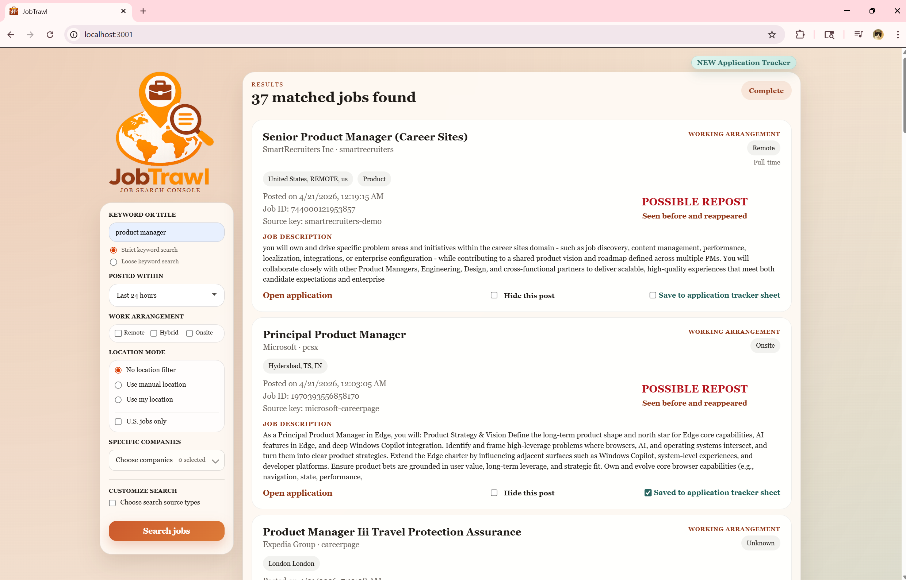
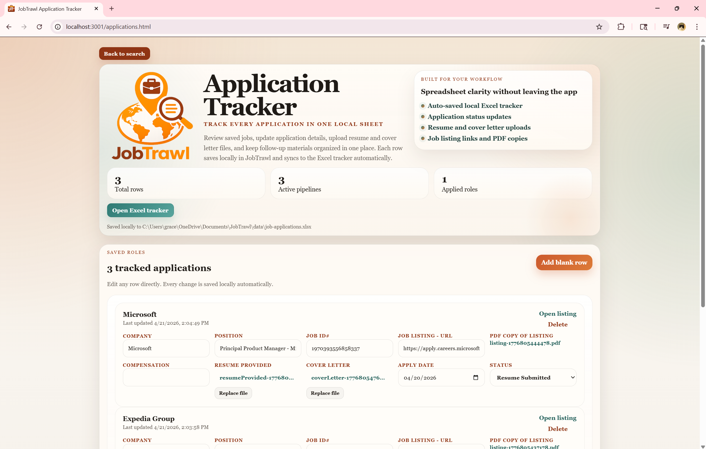
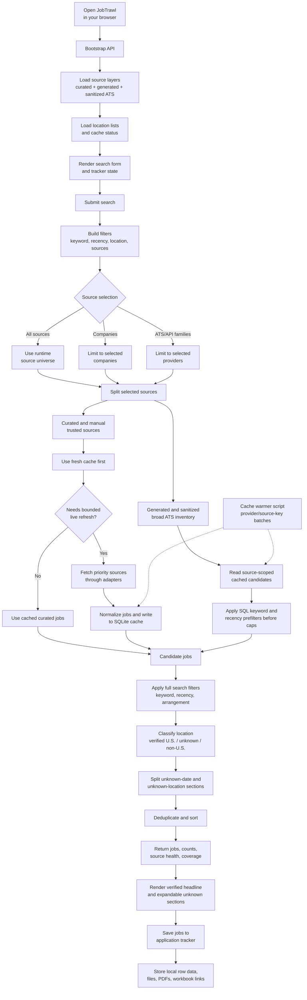

# JobTrawl

JobTrawl is a local-first job search app that aggregates direct job listings from employer career pages and ATS job boards into one searchable interface. Instead of relying on job aggregators like LinkedIn or Indeed, it pulls openings from company-controlled sources, normalizes the results into a shared format, caches them locally, and lets you filter the combined list in one place.

It is designed for three layers of coverage:

- Curated sources you hand-pick in `config/sources.json`
- Generated ATS sources in `config/generated-ats-sources.json`
- A broad sanitized ATS source inventory in `config/sanitized-ats-source-inventory.json`

The result is a local search console that can cover carefully chosen employers, larger generated ATS inventories, and a broad source universe that is warmed into the local cache over time.

## Preview





## What JobTrawl does

- Searches many employer job sources in one request
- Uses direct ATS APIs when they are available
- Falls back to parsing public employer career pages when there is no clean public API
- Loads curated sources first, then generated ATS sources, then the broad sanitized source inventory
- Normalizes results from different systems into one shared job shape
- Caches fetched jobs locally in SQLite for faster repeat searches
- Includes a provider-limited and source-key-limited cache warmer for broad ATS coverage
- Deduplicates the same job across overlapping sources by company + job ID / URL
- Returns partial results if some sources fail or time out
- Lets you narrow results by title, date, work arrangement, location, excluded companies, specific companies, or ATS/API provider type
- Preserves jobs with missing posted dates in a separate expandable section instead of inflating strict date-filter counts
- Separates verified U.S. jobs from unknown-location jobs and explicit non-U.S. drops
- Flags real reposted jobs when posting history suggests they reappeared or refreshed
- Includes an application tracker that saves files locally, generates listing PDFs, and syncs a local Excel workbook

## How it works

At a high level, a search in JobTrawl works like this:

1. JobTrawl loads its configured job sources, broad sanitized ATS inventory, and location lists.
2. When you run a search, it chooses which sources to search based on your settings:
   all default sources, specific companies, or selected ATS/API provider families.
3. It checks the local cache first so it does not have to refetch every source every time.
4. Browser searches do not live-fetch the full broad inventory. Large source batches are warmed separately into the cache.
5. It converts all jobs into one shared format, applies your filters, removes duplicates, sorts the results, and shows verified, unknown-date, and unknown-location buckets separately.

For most users, the important idea is simple: JobTrawl pulls direct listings from many company-controlled sources, standardizes them, and gives you one place to search them.

### Search and tracker flow


```mermaid
flowchart TD
    A["Open JobTrawl<br/>in your browser"] --> B["Bootstrap API"]
    B --> C["Load source layers<br/>curated + generated + sanitized ATS"]
    C --> D["Load location lists<br/>and cache status"]
    D --> E["Render search form<br/>and tracker state"]

    E --> F["Submit search"]
    F --> G["Build filters<br/>keyword, recency, location, sources"]
    G --> H{"Source selection"}
    H -->|All sources| I["Use runtime<br/>source universe"]
    H -->|Companies| J["Limit to selected<br/>companies"]
    H -->|ATS/API families| K["Limit to selected<br/>providers"]

    I --> L["Split selected sources"]
    J --> L
    K --> L
    L --> M["Curated and manual<br/>trusted sources"]
    L --> N["Generated and sanitized<br/>broad ATS inventory"]

    M --> O["Use fresh cache first"]
    O --> P{"Needs bounded<br/>live refresh?"}
    P -->|Yes| Q["Fetch priority sources<br/>through adapters"]
    P -->|No| R["Use cached curated jobs"]
    Q --> S["Normalize jobs and write<br/>to SQLite cache"]
    R --> T["Candidate jobs"]
    S --> T

    N --> U["Read source-scoped<br/>cached candidates"]
    U --> V["Apply SQL keyword and<br/>recency prefilters before caps"]
    V --> T

    T --> W["Apply full search filters<br/>keyword, recency, arrangement"]
    W --> X["Classify location<br/>verified U.S. / unknown / non-U.S."]
    X --> Y["Split unknown-date and<br/>unknown-location sections"]
    Y --> Z["Deduplicate and sort"]
    Z --> AA["Return jobs, counts,<br/>source health, coverage"]

    AA --> AB["Render verified headline<br/>and expandable unknown sections"]
    AB --> AC["Save jobs to<br/>application tracker"]
    AC --> AD["Store local row data,<br/>files, PDFs, workbook links"]

    CW["Cache warmer script<br/>provider/source-key batches"] -.-> S
    CW -.-> U
```

The chart is intentionally simplified so it stays readable in GitHub's Mermaid viewer. The sections below explain the same flow in more detail.

## Filters

The UI in `public/index.html` and `public/app.js` supports these filters:

- `Keyword or title`
- `Loose keyword search` by default, or `Strict keyword search`
- `Posted within`: `24h`, `3d`, `7d`, `14d`, `30d`
- `Work arrangement`: `remote`, `hybrid`, `onsite`
- `Location mode`
- `No location filter`
- `Use manual location`
- `Use my location`
- `U.S. jobs only`
- Manual state + city/area groups from `config/locations.json`
- Distance from your detected browser location
- Excluded companies
- Customize search by `Specific companies` or by `ATS/API sources`

### How the filters behave

- Keyword matching can run in strict or loose mode.
- Loose matching expands many common role aliases. For example, a query like `product manager` can also match nearby role variants defined in `src/lib/filters.js`.
- Recency uses `postedAt` when available.
- Strict recency counts only jobs with known dates in the requested window.
- Jobs with unknown dates can still appear in the expandable `unknown dates` section at the bottom of results.
- Arrangement filtering normalizes values to `remote`, `hybrid`, `onsite`, or `unknown`.
- Location filtering is text-based unless the distance filter is active.
- The distance filter uses browser coordinates plus a built-in location alias map for supported metros.
- `U.S. jobs only` counts only verified U.S. job locations in the headline.
- Jobs with explicit non-U.S. locations are dropped from U.S.-only results.
- Jobs without enough location data stay in a separate `Jobs with unknown location` section and do not inflate the verified U.S. count.
- Employer headquarters or company identity never prove that a job is U.S.-based.
- Customized search can either filter to an included company list or limit the search to selected ATS/API provider families.
- Excluded companies are filtered out after normalization.
- Results are deduplicated across overlapping sources, primarily by company plus job ID or normalized apply URL.

## Application tracker

JobTrawl includes a local-first application tracker for jobs you decide to save from the search results.

Tracker features include:

- inline editing for company, title, job ID, job URL, compensation, apply date, and status
- status pipeline tracking, including applied-role counts in the tracker summary cards
- file uploads for:
  - resume provided
  - cover letter
  - PDF copy of the job listing
- local job folders under `data/jobs/`
- Excel workbook generation at `data/job-applications.xlsx`
- workbook hyperlinks for:
  - job listing URL
  - resume file
  - cover letter file
  - saved PDF copy of the listing

### Tracker and workbook behavior

- Tracker rows are saved locally in JSON and synced into the Excel workbook.
- The tracker page and workbook use the same row ordering: most recently updated first.
- Listing PDFs try to capture the live job page first, then fall back to a text-based PDF built from saved listing text when sites block automation.
- Existing PDFs can be regenerated when a row has stale or low-quality listing content.

## Source strategies

JobTrawl uses adapters in `src/lib/adapters/` to fetch jobs. In practice, it gets job data in two main ways.

### 1. Direct ATS / public API integrations

When an ATS exposes a stable endpoint, JobTrawl requests job data directly from that endpoint and converts the response into a common internal shape.

Examples in this repo include:

- `Greenhouse` via `https://boards-api.greenhouse.io/...`
- `Lever` via `https://api.lever.co/...`
- `Workday` via `.../wday/cxs/.../jobs`
- `Ashby`
- `SmartRecruiters`
- `Workable`
- `Recruitee`
- `Breezy`
- `Teamtailor`
- `Zoho`
- many other ATS-specific adapters now included under `src/lib/adapters/`

This approach:

- sends requests to a provider-specific jobs endpoint
- pages through results when needed
- pulls fields like title, location, department, posted date, apply URL, and job description
- converts each response into the same shared job format used throughout the app

This is the cleanest and most reliable path because the source data is already structured.

### 2. Public career-page parsing and scraping

Some employers do not expose a clean public API. In those cases, JobTrawl fetches the public career page and extracts jobs from the page itself.

This logic lives mostly in `src/lib/adapters/hosted-board.js`.

This approach can include:

- downloading public HTML from a careers page
- looking for structured job data such as JSON-LD, embedded page state, ATS-specific JSON blobs, job sitemaps, or known provider layouts
- falling back to link extraction when a page clearly contains job listings but does not expose a cleaner data source
- filtering out non-job links such as login pages, blog pages, talent networks, privacy pages, and generic careers landing pages
- optionally opening some job detail pages to fill in missing posted dates

This is effectively "scraping" public employer career pages, but it is focused on publicly visible job content and tries structured data first before falling back to looser HTML parsing.

### Why both approaches matter

There is no single public API for every ATS and every employer website. JobTrawl mixes API adapters with public-page extraction so it can cover both:

- ATS platforms with usable public endpoints
- employer-hosted career sites that only expose jobs through HTML, embedded JSON, or sitemaps

That hybrid approach is the main reason the project can support a wide range of sources.

Recent adapter correctness work focuses on preserving source-provided location data instead of guessing:

- BambooHR reads active `/careers/list` JSON boards when available.
- Workday preserves multi-location detail data and avoids vague labels such as `2 Locations` when real locations exist.
- iCIMS reads detail-page JSON-LD job locations.
- Manatal passes structured `city`, `state`, and `country` API fields into normalization.
- Explicit non-U.S. location text, such as `Remote from Bulgaria`, stays out of verified U.S. results.

## What happens after jobs are found

Regardless of where a job comes from, JobTrawl converts it into a shared structure with fields such as:

- source key
- company
- provider
- title
- department or team
- location label
- city / region / country
- work arrangement
- posted / updated timestamps
- apply URL
- description snippet
- search text
- employment type
- compensation

After that, JobTrawl:

- applies your filters
- preserves unknown-date matches separately when a strict recency filter is active
- preserves unknown-location matches separately when `U.S. jobs only` is active
- drops explicit non-U.S. locations from verified U.S. results
- counts matches per source
- removes duplicates
- sorts results by the newest known date first
- shows source health information alongside the results

Location correctness is deliberately conservative. A U.S.-based employer does not make every job a U.S. job. Remote roles without a country stay unknown. Multi-location jobs can count as verified U.S. only when at least one actual job location is U.S., not when compensation text, employer identity, or a vague location count merely hints at it.

## Local cache

JobTrawl caches jobs on disk so searches do not always need to refetch every source.

- Primary cache: `data/jobs-cache.sqlite`
- Fallback cache: `data/jobs-cache.json` if SQLite is unavailable

Cache behavior:

- each source keeps sync state and last-error tracking
- searches can reuse fresh cached results
- priority and curated sources can be refreshed without sweeping the whole source universe
- broad generated inventory sources are searched from cache instead of live-fetched inside one browser request
- large generated ATS inventories are source-scoped and keyword-prefiltered before cached postings are loaded
- dated and unknown-date cache candidate pools are capped separately so one group does not starve the other
- targeted cache warming can run by provider, keyword-priority strategy, or source-key file
- expired postings are pruned automatically

There are also API endpoints for cache status and manual sync:

- `GET /api/cache/status`
- `POST /api/cache/sync`

## Source configuration

JobTrawl merges source files in trust order:

- `config/sources.json`: curated, hand-maintained sources
- `config/generated-ats-sources.json`: generated ATS inventory from earlier source discovery
- `config/sanitized-ats-source-inventory.json`: broad sanitized ATS source inventory

Curated sources win on duplicate source keys, existing generated sources win over broad sanitized sources, and the broad inventory never overrides a more trusted record. `sourceKey` values from generated files are mapped into runtime `key` values before adapters receive the source.

The broad sanitized inventory is source-level only. It is intended to include safe fetch configuration such as provider, source key, company, careers URL, API URL, and adapter fields. It must not include job rows, local file paths, vendor database paths, secrets, cookies, captured JavaScript bundles, or local machine metadata.

On the current branch, the runtime source universe is roughly:

- about `120` curated sources
- `10k+` generated ATS sources
- about `32k` total sources when the sanitized inventory is present

Generated ATS inventory can still be imported from the older reference flow:

- `npm run import:generated-ats`

The broad sanitized inventory is generated and verified with:

```powershell
node scripts/generate-sanitized-ats-source-inventory.mjs
node scripts/validate-sanitized-ats-source-inventory.mjs
```

Cache warming is intentionally separate from browser search. Use report-only mode first, then warm small provider or source-key batches:

```powershell
node scripts/warm-ats-source-cache.mjs --report-only --provider bamboohr --limit 50
node scripts/warm-ats-source-cache.mjs --provider workday --limit 50 --strategy keyword-priority --keyword "product manager" --force
node scripts/warm-ats-source-cache.mjs --source-key-file data/my-target-sources.txt --timeout-ms 60000 --force
```

Files under `data/`, cache databases, vendor discovery databases, retry files, reports, and cache-warm progress artifacts are local working data and should not be committed unless a specific small artifact is intentionally promoted.

## Supported provider families

The adapter registry currently includes support for:

- `Greenhouse`
- `Lever`
- `Workday`
- `Ashby`
- `SmartRecruiters`
- `Workable`
- `Recruitee`
- `Jobvite`
- `ApplicantPro`
- `ApplyToJob / JazzHR`
- `iCIMS`
- `UltiPro / UKG`
- `Taleo`
- `BambooHR`
- `BreezyHR`
- `ApplicantAI`
- `Career Plug`
- `Career Puck`
- `Fountain`
- `Gem`
- `Getro`
- `HRM Direct`
- `Jobaps`
- `JOIN`
- `Manatal`
- `SAP HR Cloud`
- `Talent Lyft`
- `Talent Reef`
- `Talexio`
- `Team Tailor`
- `The Applicant Manager`
- `Zoho Recruit`
- generic `Career Page` extraction for public employer sites

Coverage quality varies by provider and by company implementation. API-backed adapters are usually the most stable. Career-page extraction is broader but more fragile because employers can change their HTML at any time.

## Saved listing PDFs

When you save a job to the application tracker, JobTrawl tries to keep a readable PDF copy of the listing.

The PDF pipeline:

- first tries a live page capture when the site allows it
- falls back to structured listing text already gathered during search or save
- strips common junk like raw JSON dumps, shell page chrome, and repeated duplicate text
- normalizes weird characters before writing the final PDF

This makes the saved PDFs much more useful for follow-up, interviewing, and comparing the exact role text you originally applied to.

## Installation

### Before you start

- You need an internet connection because JobTrawl fetches live job listings from public job boards and career pages.
- You need `Node.js 22` or newer installed on your computer.
- `npm` usually comes with Node.js, so you don't need to install it separately.

If you're not technical, the easiest way to think about setup is:

1. install Node.js
2. download the JobTrawl folder
3. open that folder in a terminal
4. run one install command
5. run one start command
6. open the local web address in your browser

### Step 1: Install Node.js

1. Go to [https://nodejs.org](https://nodejs.org)
2. Download the current `LTS` version for your computer
3. Run the installer
4. Accept the default options unless you want to change where Node is installed
5. When the installation finishes, restart your terminal if you already had one open

To make sure Node.js installed correctly, open a terminal and run:

```powershell
node -v
```

You should see a version number such as `v22.x.x` or newer.

If that works, check npm too:

```powershell
npm -v
```

### Step 2: Download JobTrawl

You can download the project in either of these ways.

#### Option A: Download the ZIP file

1. Open the GitHub repository page
2. Click the green `Code` button
3. Click `Download ZIP`
4. Extract the ZIP somewhere easy to find, like your Desktop or Documents folder

#### Option B: Clone with Git

If you already use Git, run:

```powershell
git clone https://github.com/ugraphix/JobTrawl.git
cd JobTrawl
```

If you downloaded the ZIP instead, open a terminal and move into the extracted folder. Example:

```powershell
cd "$HOME\\Downloads\\JobTrawl"
```

### Step 3: Install JobTrawl

Inside the JobTrawl folder, run:

```powershell
npm install
```

If PowerShell blocks `npm`, use:

```powershell
npm.cmd install
```

Wait until the install finishes.

### Step 4: Start JobTrawl

Run:

```powershell
npm start
```

If PowerShell blocks `npm`, use:

```powershell
npm.cmd start
```

When it starts correctly, JobTrawl runs on:

- [http://localhost:3001](http://localhost:3001)

Open that address in your web browser.

### Step 5: If it does not open

- Make sure you are still inside the JobTrawl folder before running commands.
- Make sure Node.js installed successfully by running `node -v`.
- If `npm` does not work in PowerShell, use `npm.cmd`.
- If `http://localhost:3001` does not load, check the terminal window for an error message.
- If port `3001` is already being used by another app, stop that app or change the `PORT` environment variable before starting JobTrawl.
- If you're on an older version of Node.js, upgrade to Node `22` or newer and try again.

### Development mode

```powershell
npm run dev
```

If PowerShell blocks `npm`, use:

```powershell
npm.cmd run dev
```

## Basic usage

1. Start the app with `npm start`
2. Open `http://localhost:3001`
3. Enter a keyword or role title
4. Choose recency, arrangement, and location filters
5. Optionally customize the search to specific companies or ATS/API source types
6. Optionally exclude companies
7. Run the search
8. Open the direct application link from a result card

## Configuring your own sources

Add or edit entries in `config/sources.json`.

Example:

```json
{
  "key": "openai-ashby",
  "company": "OpenAI",
  "provider": "ashby",
  "organization": "openai"
}
```

```json
{
  "key": "stripe-greenhouse",
  "company": "Stripe",
  "provider": "greenhouse",
  "boardToken": "stripe"
}
```

```json
{
  "key": "example-careerpage",
  "company": "Example Co",
  "provider": "careerpage",
  "careersUrl": "https://example.com/careers"
}
```

Provider-specific fields vary by adapter. A few common examples:

- `greenhouse`: `boardToken`
- `lever`: `site`
- `ashby`: `organization`
- `workday`: `host`, `tenant`, `site`
- `smartrecruiters`: `companyIdentifier`
- `workable`: `subdomain`
- `recruitee`: `subdomain`
- `jobvite`: `site` or `careersUrl`
- `careerpage`: `careersUrl` plus optional parsing hints
- `icims`: source-specific credentials or portal details when required

## Project structure

```text
config/                     Curated, generated, sanitized source, and location configuration
data/                       Local cache database, reports, retry lists, and logs
public/                     Browser UI
scripts/                    Source inventory, validation, cache warming, and sync helpers
src/server.js               HTTP server and API routes
src/lib/search.js           Search pipeline
src/lib/filters.js          Keyword, recency, arrangement, and location filters
src/lib/cache-db.js         Local cache layer
src/lib/adapters/           ATS and career-page adapters
```

## Notes and tradeoffs

- There is no universal public jobs API for every company or ATS.
- Some boards expose rich structured APIs; others require HTML parsing.
- Career-page scraping is inherently more brittle than API integrations.
- Posted dates are not always available; JobTrawl can keep unknown-date jobs in separate sections.
- Work arrangement and location metadata are inconsistent across employers, so normalization is best-effort.
- `U.S. jobs only` is intentionally strict: explicit foreign locations are dropped, and ambiguous locations stay separate.
- Browser searches should not live-fetch the full broad inventory. Warm large source sets through the cache warmer first.
- Source failures do not block the whole search; the app returns partial results when possible.

## Summary

JobTrawl is a local search app for direct employer listings. It combines ATS APIs and public career-page scraping, standardizes the results, caches them locally, and gives you one place to search across curated sources, generated ATS inventories, and a broad sanitized source universe.
